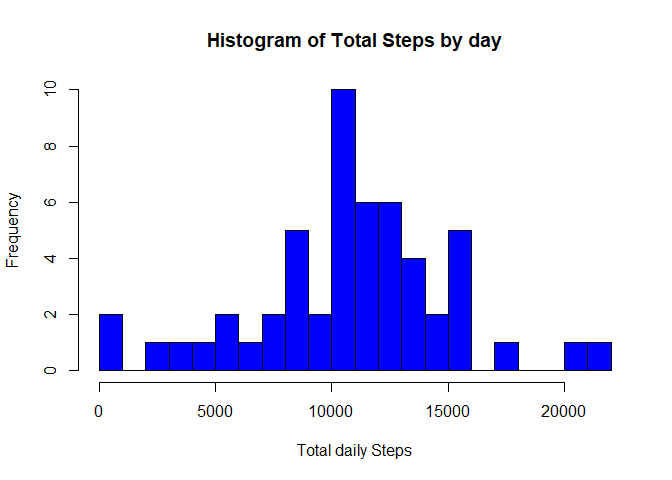
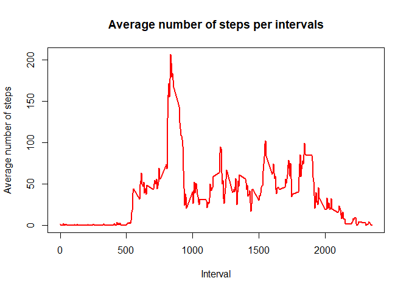
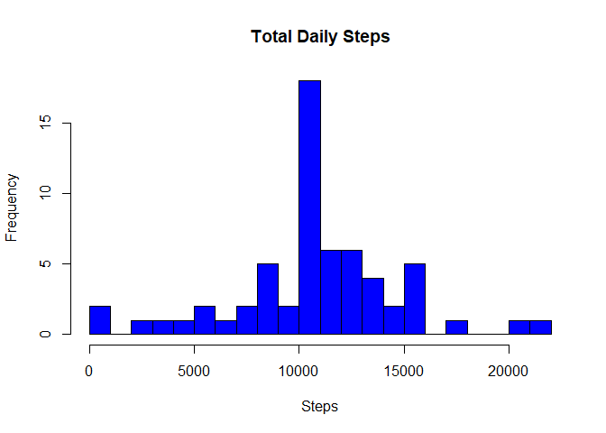

## Loading and preprocessing the data

```r
unzip("activity.zip")
ActivityData<-read.csv("C:/Users/Shakti Jaiswal/Desktop/RajBhaiya/5th Course/RepData_PeerAssessment1/activity.csv",header = TRUE)

head(ActivityData)
```

```
##   steps       date interval
## 1    NA 2012-10-01        0
## 2    NA 2012-10-01        5
## 3    NA 2012-10-01       10
## 4    NA 2012-10-01       15
## 5    NA 2012-10-01       20
## 6    NA 2012-10-01       25
```


## What is mean total number of steps taken per day?
Step 1 & 2:

```r
library(magrittr)
library(dplyr)
```

```
## 
## Attaching package: 'dplyr'
```

```
## The following objects are masked from 'package:stats':
## 
##     filter, lag
```

```
## The following objects are masked from 'package:base':
## 
##     intersect, setdiff, setequal, union
```

```r
databydate <- ActivityData %>% select(date, steps) %>% group_by(date) %>% summarize(sumsteps= sum(steps)) %>%na.omit()
hist(databydate$sumsteps, xlab = "Total daily Steps",main="Histogram of Total Steps by day",col = "blue", breaks = 20)
```

<!-- -->

Step 3:
Here is the mean of the total number of steps taken per day:

```r
mean(databydate$sumsteps)
```

```
## [1] 10766.19
```
Here is the median of the total number of steps taken per day:

```r
median(databydate$sumsteps)
```

```
## [1] 10765
```
## What is the average daily activity pattern?

## Time series plot of the average number of steps taken
Step 1:

```r
Average_daily_activity <- aggregate(ActivityData$steps, by=list(ActivityData$interval), FUN=mean, na.rm=TRUE)
names(Average_daily_activity) <- c("interval", "mean")
plot(Average_daily_activity$interval, Average_daily_activity$mean, type = "l", col="red", lwd = 2, xlab="Interval", ylab="Average number of steps", main="Average number of steps per intervals")
```

<!-- -->

Step 2: Which 5-minute interval, on average across all the days in the dataset, contains the maximum number of steps?

```r
Average_daily_activity[which.max(Average_daily_activity$mean), ]$interval
```

```
## [1] 835
```

## Imputing missing values
Step 1:Calculate and report the total number of missing values in the dataset (i.e. the total number of rows with NAs)

```r
sum(is.na(ActivityData$steps))
```

```
## [1] 2304
```

Step 2: Devise a strategy for filling in all of the missing values in the dataset. The strategy does not need to be sophisticated. For example, you could use the mean/median for that day, or the mean for that 5-minute interval, etc.

```r
Imputed_steps <- Average_daily_activity$mean[match(ActivityData$interval, Average_daily_activity$interval)]
```

Step 3: Create a new dataset that is equal to the original dataset but with the missing data filled in.

```r
Activity_imputed <- transform(ActivityData, steps = ifelse(is.na(ActivityData$steps), yes = Imputed_steps, no = ActivityData$steps))
head(Activity_imputed)
```

```
##       steps       date interval
## 1 1.7169811 2012-10-01        0
## 2 0.3396226 2012-10-01        5
## 3 0.1320755 2012-10-01       10
## 4 0.1509434 2012-10-01       15
## 5 0.0754717 2012-10-01       20
## 6 2.0943396 2012-10-01       25
```

```r
Total_steps_imputed <- aggregate(steps ~ date, Activity_imputed, sum)
names(Total_steps_imputed) <- c("date", "daily_steps")
summary(Total_steps_imputed)
```

```
##          date     daily_steps   
##  2012-10-01: 1   Min.   :   41  
##  2012-10-02: 1   1st Qu.: 9819  
##  2012-10-03: 1   Median :10766  
##  2012-10-04: 1   Mean   :10766  
##  2012-10-05: 1   3rd Qu.:12811  
##  2012-10-06: 1   Max.   :21194  
##  (Other)   :55
```

Step 4: Make a histogram of the total number of steps taken each day.

```r
hist(Total_steps_imputed$daily_steps, xlab = "Steps", ylab = "Frequency", main = "Total Daily Steps",col = "blue", breaks = 20)
```

<!-- -->

Calculate and report the mean and median total number of steps taken per day.

Here is the mean of the total number of steps taken per day:

```r
mean(Total_steps_imputed$daily_steps)
```

```
## [1] 10766.19
```
Here is the median of the total number of steps taken per day:

```r
median(Total_steps_imputed$daily_steps)
```

```
## [1] 10766.19
```

## Are there differences in activity patterns between weekdays and weekends?

Step 1: Create a new factor variable in the dataset with two levels – “weekday” and “weekend” indicating whether a given date is a weekday or weekend day.

```r
Activity_imputed$date <- as.Date(Activity_imputed$date)
Activity_imputed$weekday <- weekdays(Activity_imputed$date)
Activity_imputed$weekend <- ifelse(Activity_imputed$weekday=="Saturday" | Activity_imputed$weekday=="Sunday", "Weekend", "Weekday" )
```

Step 2: Make a panel plot containing a time series plot (i.e. type = "l") of the 5-minute interval (x-axis) and the average number of steps taken, averaged across all weekday days or weekend days (y-axis).

```r
library(ggplot2)
meandataweekendweekday <- aggregate(Activity_imputed$steps , by= list(Activity_imputed$weekend, Activity_imputed$interval), na.omit(mean))
names(meandataweekendweekday) <- c("weekend", "interval", "steps")

ggplot(meandataweekendweekday, aes(x=interval, y=steps, color=weekend)) + geom_line()+
facet_grid(weekend ~.) + xlab("Interval") + ylab("Mean of Steps") +
    ggtitle("Comparison of Average Number of Steps in Each Interval")
```

<!-- -->
